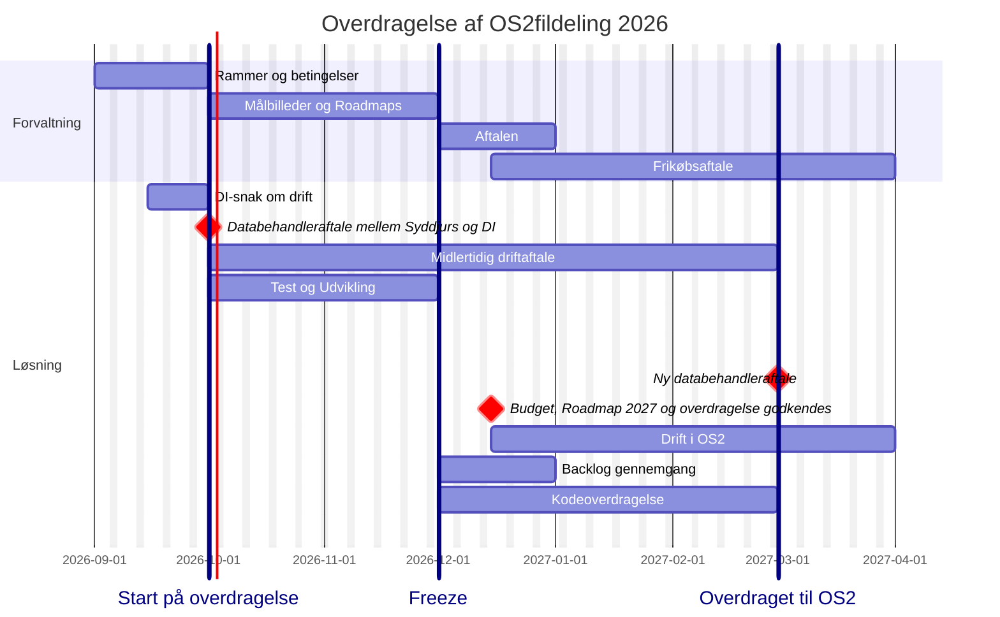

# Highlevel plan for overdragelsen til OS2


```mermaid

gantt
    dateFormat  YYYY-MM-DD
    title       Overdragelse af OS2fildeling 2026
   excludes    weekends
    tickInterval 1month
    %% (`excludes` accepts specific dates in YYYY-MM-DD format, days of the week ("sunday") or "weekends", but not the word "weekdays".)


    section Forvaltning
    Rammer og betingelser                              :des1, 2026-09-01, 2026-10-01
    Målbilleder og Roadmaps                            :des2, after des1, 2026-12-01
    Aftalen                                            :des3, after des2, 2027-01-01
    Frikøbsaftale                                      :des7, 2026-12-15, 2027-04-01

section Løsning
    DI-snak om drift                                   :des4, 2026-09-15, 2026-10-01
    Databehandleraftale mellem Syddjurs og DI          :crit, milestone, a1, 2026-10-01, 0d
    Midlertidig driftaftale                            :des4, 2026-10-01, 2027-03-01
    Test og Udvikling                                  :des5, 2026-10-01, 2026-12-01
    Freeze                                             :vert, 2026-10-01

    Start på overdragelse                              :vert, 2026-09-01
    Ny databehandleraftale                             :crit, milestone, a1, 2027-03-01, 0d
    Budget, Roadmap 2027 og overdragelse godkendes     :crit, milestone, a1, 2026-12-15, 0d
    Drift i OS2                                        :des8, 2026-12-15, 2027-04-01
    Backlog gennemgang                                 :des9, 2026-12-01, 2027-01-01
    Kodeoverdragelse                                   : des10, 2026-12-01, 2027-03-01
    Overdraget til OS2                                 :vert, 2027-01-01


```
Vi skal have følgende milestones ind
-  overdragelsesaftale Syddjurs og OS2 - DI og OS2 (Allonge)
-  Underskriv tilslutning
-  Underskriv frikøb


```
